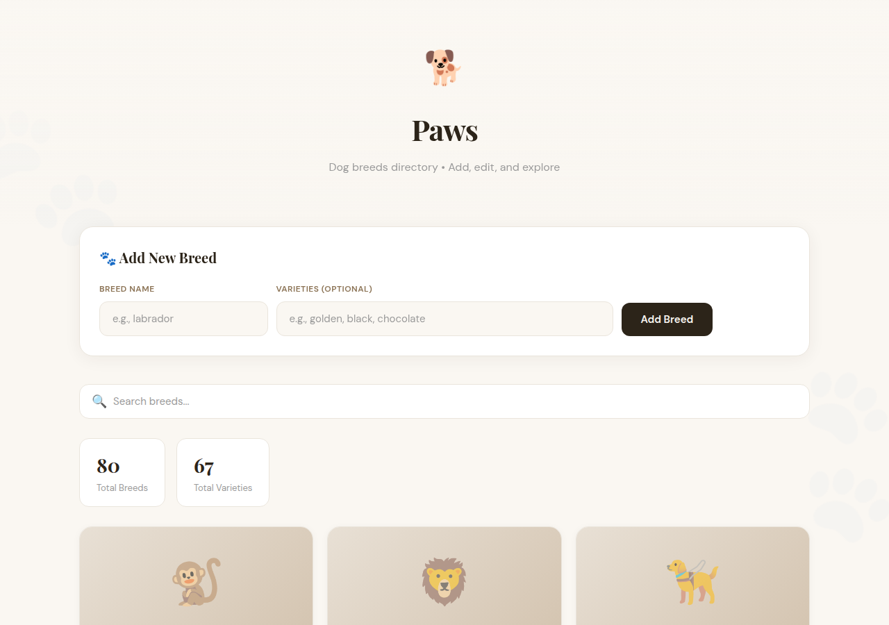

# 🐕 Paws - Dogs Directory API

A lightweight RESTful API for managing dog breeds with a clean, minimal web interface. Built with Go/Gin and vanilla JavaScript — no build step required.

**Live Demo:** https://lee-dogs-api.loca.lt



---

## ✨ Features

- **Full CRUD Operations** — Create, Read, Update, and Delete dog breeds
- **JSON Persistence** — Data persists across restarts (no database required)
- **RESTful API** — Clean API endpoints for programmatic access
- **CORS Enabled** — Works with any frontend or API client
- **Single Binary** — Compiles to a single executable
- **Docker Ready** — One-command deployment
- **Beautiful UI** — Minimal, dog-themed web interface with emoji icons
- **Search & Filter** — Real-time breed search
- **Responsive Design** — Works on mobile and desktop

---

## 🛠️ Tech Stack

| Layer | Technology |
|-------|------------|
| Backend | Go 1.21+ |
| Framework | Gin |
| Data | JSON file |
| Frontend | Vanilla HTML/CSS/JS |
| Fonts | Playfair Display, DM Sans |
| Container | Docker |

---

## 📡 API Reference

Base URL: `https://lee-dogs-api.loca.lt/api`

### List All Breeds

```http
GET /dogs
```

**Response:**
```json
{
  "affenpinscher": [],
  "bulldog": ["boston", "french"],
  "labrador": ["golden", "black"]
}
```

### Get Single Breed

```http
GET /dogs/:breed
```

**Response:**
```json
{
  "breed": "labrador",
  "varieties": ["golden", "black"]
}
```

### Add Breed

```http
POST /dogs
Content-Type: application/json

{
  "breed": "newbreed",
  "varieties": ["variety1", "variety2"]
}
```

**Response:** `201 Created`
```json
{
  "breed": "newbreed",
  "varieties": ["variety1", "variety2"]
}
```

### Update Breed

```http
PUT /dogs/:breed
Content-Type: application/json

{
  "varieties": ["new", "varieties"]
}
```

**Response:** `200 OK`
```json
{
  "breed": "labrador",
  "varieties": ["new", "varieties"]
}
```

### Delete Breed

```http
DELETE /dogs/:breed
```

**Response:** `200 OK`
```json
{
  "message": "Breed 'labrador' deleted"
}
```

### Error Responses

```json
{"error": "Breed not found"}      // 404
{"error": "Breed already exists"} // 409
{"error": "Invalid request"}      // 400
```

---

## 🚀 Quick Start

### Option 1: Pre-built Binary

```bash
# Download from releases or build yourself (see below)
./server
```

### Option 2: Run from Source

```bash
# Requires Go 1.21+
go run main.go
```

### Option 3: Docker

```bash
# Build
docker build -t dogs-api .

# Run
docker run -p 8080:8080 dogs-api
```

### Option 4: Docker Compose

```yaml
version: '3'
services:
  dogs-api:
    build: .
    ports:
      - "8080:8080"
    volumes:
      - ./dogs.json:/root/dogs.json
```

```bash
docker-compose up -d
```

---

## 🔧 Configuration

| Environment | Default | Description |
|-------------|---------|-------------|
| `PORT` | `8080` | Server port |
| `GIN_MODE` | `debug` | Set to `release` for production |

---

## 📁 Project Structure

```
dogs-api/
├── main.go           # Go backend (Gin router + CRUD handlers)
├── index.html       # Web UI
├── dogs.json        # Data file (auto-created on first run)
├── Dockerfile       # Docker build
├── go.mod           # Go dependencies
├── go.sum           # Go checksums
├── server           # Compiled binary (gitignored)
└── README.md        # This file
```

---

## 🔄 Building from Source

### Prerequisites

- Go 1.21 or later
- Docker (optional)

### Build Binary

```bash
# Download dependencies
go mod tidy

# Compile
go build -o server .

# Run
./server
```

### Build for Different Platforms

```bash
# Linux
CGO_ENABLED=0 GOOS=linux GOARCH=amd64 go build -o server .

# macOS
CGO_ENABLED=0 GOOS=darwin GOARCH=amd64 go build -o server .

# Windows
CGO_ENABLED=0 GOOS=windows GOARCH=amd64 go build -o server.exe .
```

---

## 🎨 UI Features

- **Cream & Brown Palette** — Warm, minimal aesthetic
- **Emoji Breed Icons** — Each breed has a matching emoji
- **Real-time Search** — Filter breeds as you type
- **Stats Dashboard** — Total breeds and varieties count
- **Responsive Grid** — Adapts to screen size
- **Toast Notifications** — Success/error feedback
- **Modal Editor** — Clean edit interface with backdrop blur

---

## 📝 Data Format

The `dogs.json` file stores breed data as a simple key-value map:

```json
{
  "breedname": ["variety1", "variety2"],
  "labrador": ["golden", "black", "chocolate"],
  "poodle": ["miniature", "standard", "toy"]
}
```

---

## 🔒 Security Notes

- No authentication — suitable for development/demo
- CORS allows all origins (`*`)
- For production, add authentication middleware and restrict CORS
- Data is stored in plain JSON — no encryption

---

## 🚢 Deployment

### VPS/Server

```bash
# Build on server or copy binary
scp server user@server:/path/to/dogs-api/
ssh user@server

# Run with systemd (optional)
./server
```

### Cloud Platforms

**Railway:**
```bash
railway login
railway init
railway up
```

**Render:**
1. Connect GitHub repo
2. Set build command: `go build -o server .`
3. Set start command: `./server`

**Fly.io:**
```bash
fly launch
fly deploy
```

---

## 📜 License

MIT — Free to use, modify, and distribute.

---

## 🤝 Contributing

1. Fork the repo
2. Create a feature branch
3. Make your changes
4. Submit a PR

---

**Built with ❤️ using Go + Gin**
